<!--
SPDX-FileCopyrightText: 2024 UnionTech Software Technology Co., Ltd.

SPDX-License-Identifier: GPL-3.0-or-later
-->

# Security Center|deepin-defender|

## Overview 

Security Center is an application that provides functions such as full check, virus scan, firewall, cleanup, security tools and so on.

## Guide

You can run, close and create a shortcut for Security Center by the following ways.

### Run Security Center

1. Click  on dock to enter Launcher interface.
2. Locate  by scrolling mouse wheel or searching by "Security Center" in Launcher interface.
3. Right-click , you can

   - Click **Send to desktop** to create a desktop shortcut.
   - Click **Send to dock** to fix the application on dock.
   - Click **Add to startup** to add it to startup, it will automatically run when the system starts up.

### Exit Security Center

- Right-click  on the Dock, select **Exit** to exit.
- Click  in the main interface and select **Exit**.

## Operations

### Full Check

1. Open Security Center, click **Full Check** in the left panel, you can click **Check Now** to examine the system. 
2. After the system examination is finished, if there is any abnormality, you can operate on each problem item separately, or, you can click **Fix All** to fix many problems.

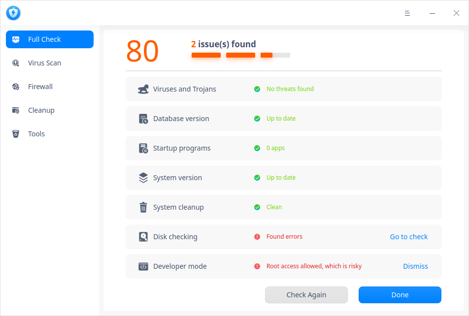

3. When the process completes, click **Done** to return to "Full Check" screen.

### Virus Scan

#### Scanning

Security Center supports full scanning, quick scanning, and custom scanning. 

1. On the homepage, click **Virus Scan** in the left panel, and select a scanning method. After scanning finishes, you will see the result.

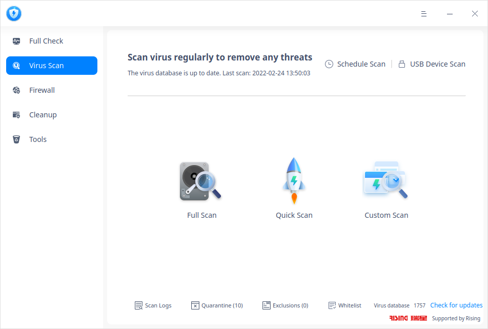

2. According to the result, you can choose corresponding operations to one or multiple results.

   **Singularly Operation:**

   - Repair: click , this risk will be fixed, and it won't be diagnosed as a risk for the next time.

   - Quarantine: click , this risk will be quarantined, other files would not be affected. It won't be diagnosed as a risk for the next time. You can click **Quarantine** icon below to view it. 
   
   - Trust: click , this risk will be trusted. It won't be diagnosed as a risk for the next time. You can view it in "Exclusion". 
   
   **Batch Operation:**
   
   Check all risks you want to deal with, select **Repair Now**, **Quarantine Now** or **Add to Whitelist** from the drop-down box, and then click **Start**. 

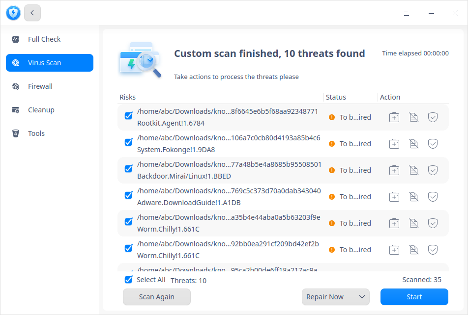

#### Schedule Scan

For quick scan and full scan, you can also set up a schedule scan. This function is turned off by default, when it is turned on, you can perform virus scanning tasks according to the settings.

- Scan type: quick scan and full scan are supported.
- Scan time: select or customize the scan time.
- When viruses are found:
   - Ask me: After a virus is found, a confirmation box will pop up. You can select **Ignore** to not remove it, or select **Remove Now**. If you don't carry out any operation, “Ignore” is selected by default.
   - Auto remove: Automatically remove the virus after it is found.

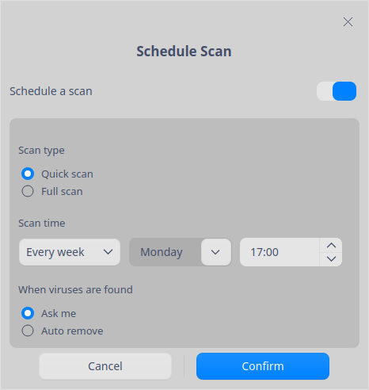

#### USB Device Scan

For USB storage devices, you can set whether to automatically scan and how to handle viruses found.
   - Ask me: After a virus is found, a confirmation box will pop up. You can select **Remove Now**, or select **Cancel** to exit scanning. 
   - Auto remove: Automatically remove the virus after it is found.

#### Quarantine

On the interface of Virus Scan, you can click **Quarantine** icon below to view the list of quarantined files, and click **Restore** to move them out of it.

#### Exclusions

On the interface of Virus Scan, you can click **Exclusions** to view the list of trusted files, and click **Remove** to move them out of it.

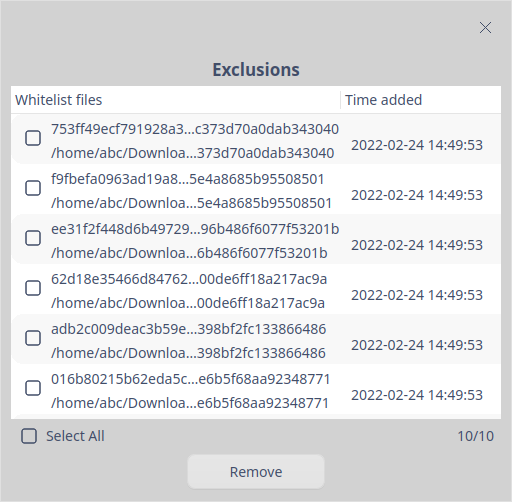

#### Whitelist

On the interface of Virus Scan, you can click **Whitelist** icon below to view the list of quarantined files, and click **Remove** to move them out of it.

#### Scan Logs
On the interface of Virus Scan, you can click **Scan Logs** icon below to view scanning time, scan type, results and action. Click  to view details and you can also delete logs.

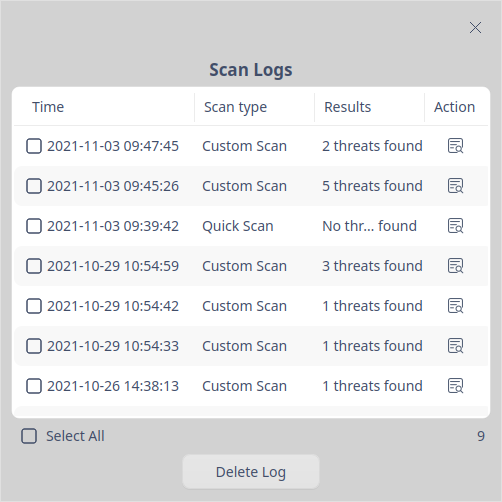

#### Virus database update

New virus keep coming out everyday. So your virus database should be regularly updated to satisfy the security needs of your computer. Currently online update and offline update are supported.

**Update Online**

When a new virus database is detected, click **Update** on the "Virus Scan" screen to update the virus database. If no new database is detected, you can click **Check for Updates**.

**Update Offline**

If you are unable to update your virus database online due to network disconnection or other reasons, you can choose to update offline.

1. Click  on the interface. 
2. Select **Update virus databases offline**. File Manager pops up. Import the corresponding .zip format virus database file. If the antivirus engine you are currently using is Rising, you must import the Rising virus database file.
3. After successful import, the virus database version in the bottom right corner of the Virus Scan interface is updated accordingly.

### Firewall

Open Security Center, click **Firewall** in the left panel. In the "Firewall" screen, you need to enter the system login password for authentication to turn on or off the firewall.

The firewall switch is turned off by default and the network protection policy cannot take effect. "Private network" is selected when you switch it on. You can also switch to public network policy or customize network protection rules.

> Notes: When the system security level is switched to High or Medium, the firewall switch is turned on.

- Public network: mainly for public network signals such as stations, shopping malls, cafes, and so on, executing the default policy under public network scenarios.

- Private network: mainly for office and home network scenarios, executing the default policy under private network scenarios.

- Customize: After selecting this option, you can configure advanced firewall rules by yourself.

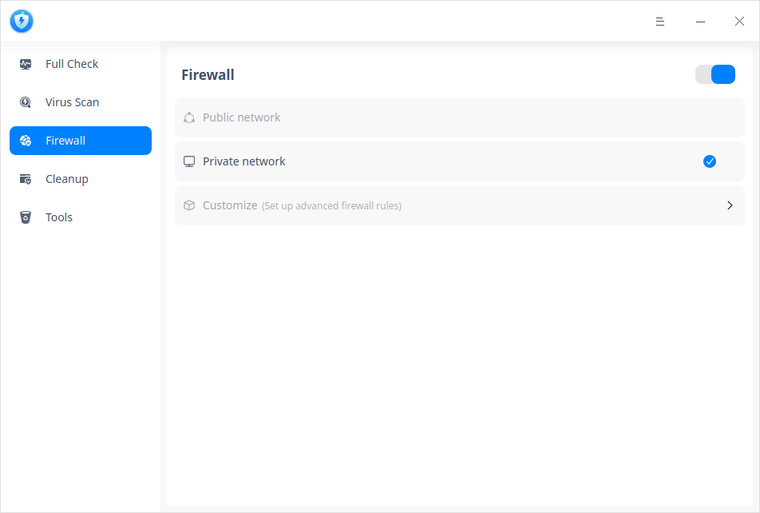

#### Customize

1. In the Firewall interface, check "Customize" and click the icon > to enter the configuration screen.

2. Click **Add** and then input or check firewall rules, including rule name, program, policy, direction, protocol and so on.

   - Rule name: The rule name cannot be repeated, you can use the default name or custom name.

   - Program: "All" is selected by default. Or you can check the drop-down box or fuzzy search for the corresponding service in the input box.

   - Policy: "Allow" is selected by default, which means packet transmission is allowed. Select "Deny" to prohibit packet transmission.

   - Direction: "Both" is selected by default. "Outbound" means the local host accesses external data, while "Inbound" means external data enters the local host.

   - Protocol: Refers to the communication protocol supported by the system. "tcp" is selected by default, or the corresponding protocol can be checked in the drop-down box or fuzzy searched in the input box.

   - Local Port/IP: (Optional) indicating the port number and IP of the local host, the filling rules can refer to the example.

   - Remote Port/IP: (Optional) indicating the port number and IP of the remote host, please refer to the example for the filling rules.

   - Status: Unchecked by default, indicating that the rule is disabled. When checked, the rule is enabled.

   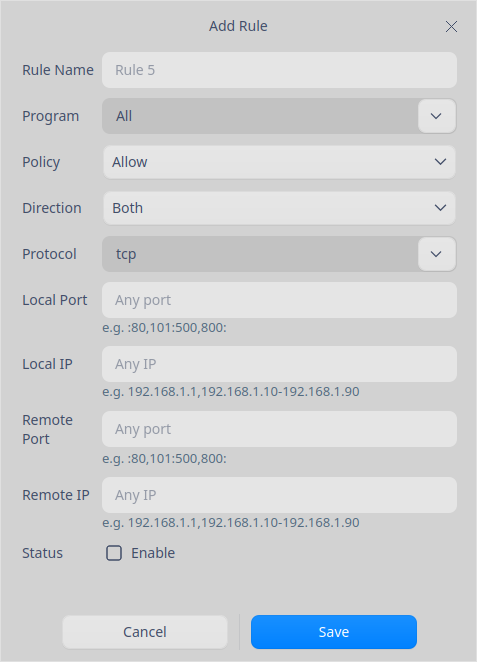

3. When you have completed all the settings, click **Save**. After that, you can view the list of rules in the configuration page.

   

4. If multiple rules are added, by default, enabled rules are displayed first and in descending order of creation time, while disabled rules are displayed later and in descending order of creation time. When there is a conflict between the rules created in succession, the enabled rule created last takes precedence.

#### Context menu

For the added rules, you can perform related operations according to the enabled status.

Singularly operation

- One enabled rule: In the context menu, only "Disable" is available.
- One disabled rule: In the context menu, you can select "Modify", "Enable" or "Delete".

Batch operation

- All enabled rules: In the context menu, only "Disable" is available.
- All disabled rules: In the context menu, you can select "Enable" or "Delete".
- Rules containing both enabled and disabled: In the context menu, you can select "Enable", "Disable" or "Delete".

### Cleanup

Operating system will produce all kinds of junks in the daily operation. When more and more junks are generated, the efficiency of the system will be affected, and disk resources are wasted. It is suggested to clean up the garbage regularly to ensure the smooth operation of the system and improve the utilization rate of resources.

1. Open Security Center and select **Cleanup** in the left panel to enter the garbage cleaning interface.

2. Check the corresponding garbage type. Currently, you can choose to clean up system junk, application junk, traces and cookies.

3. Click **Scan Now** to enter the scanning interface.

4. After scanning, the junks found in scanning can be viewed and disposed accordingly.

   - Clean up: clean up all the selected junks. You can also cancel or check more options.
   - Back: return to the cleaning interface without any processing.

5. Click **Done** after cleaning. You can also click **Cancel** during cleaning up.

### Tools

Open Security Center and select **Tools** in the left panel. You can see "System Tools" and "Network Tools" here. Click the small icons to use the tools accordingly. 

#### System Tools

**USB Connection**

On **USB Connection** interface, you can view all history about USB devices with storage function connecting to your computer.

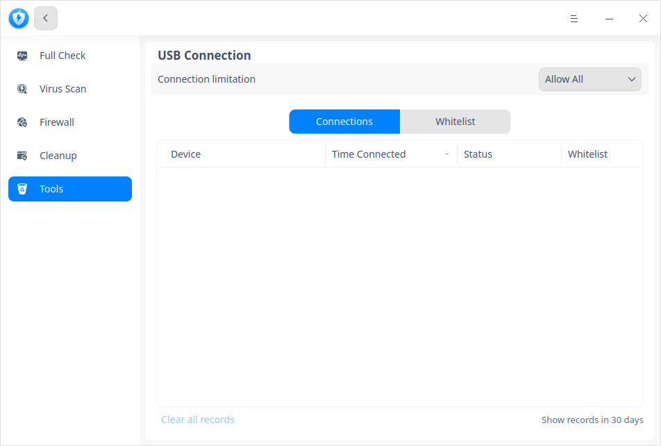

You can also add the USB device used very often into whitelist, and select **Only Whitelist** in **Connection limitation** to avoid data breach.

**Login Safety**

On **Login Safety** interface, you can set password security levels and notifying period before password expired and change password regularly. 
- **High** or **Medium**: If you have chosen either one of them, when you modify password in Control Center or setup password when creating new ID, the password you set will not be saved successfully if it doesn't comply with the requirement of the corresponding level. You can go to Control Center to reset your password or modify security level in Security Center. 
- **Low**:  If you have chosen this option, when you modify password in Control Center or setup password when creating new ID, the new password will be saved directly. 

**Startup Programs**

In this interface, only applications in the Launcher are displayed and detailed by "Name", "Auto Startup" and "Action". You can choose "Enabled" or "Disabled" for each application. 

**Security Level**

The security level configuration function portal is hidden by default, and when enabled, it will strengthen the control of system permissions. If you need to use it, you can contact our technical support to get the way to open it.

According to the usage scenario, choose the appropriate system security level configuration, the default system security level is low.

- **High**: Turn on the security protection of Equal Protection Level 3, turn on the security protection of identification, autonomous access control, tagging and mandatory access control, security audit, data integrity verification, data confidentiality, network security, operation security, and resource monitoring. Also configure passwords for system admin, audit admin, and security admin account.
- **Medium**: Turn on the basic security protection, and also open the firewall network security protection, and adjust password security level to medium, to protect the system security.
- **Low**: Applicable to trusted usage environment, providing basic security protection.

(1) Switch from low or medium to high

1. In the Security Level screen, check "High". The authentication box pops up, enter the system login password for authentication.

   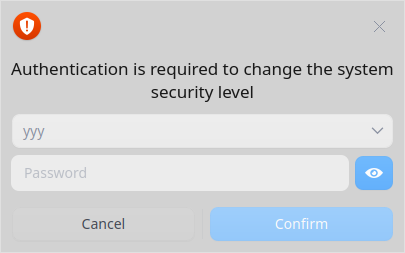

2. Click **Confirm** in the pop-up window. Configure the passwords for system admin, audit admin, and security admin account, and assign different permissions to each administrator.

   - System admin (sysadm): to create, delete users, install software, and other system-related settings.
   - Audit admin (audadm): to add audit rules, view audit logs.
   - Security admin (secadm): to manage security context, inquiry and set security configurations.

   

4. After successful configuration, reboot the system to make all settings effective, some privileges of normal users will be restricted. The system login screen will show three administrator accounts, which can be switched.

   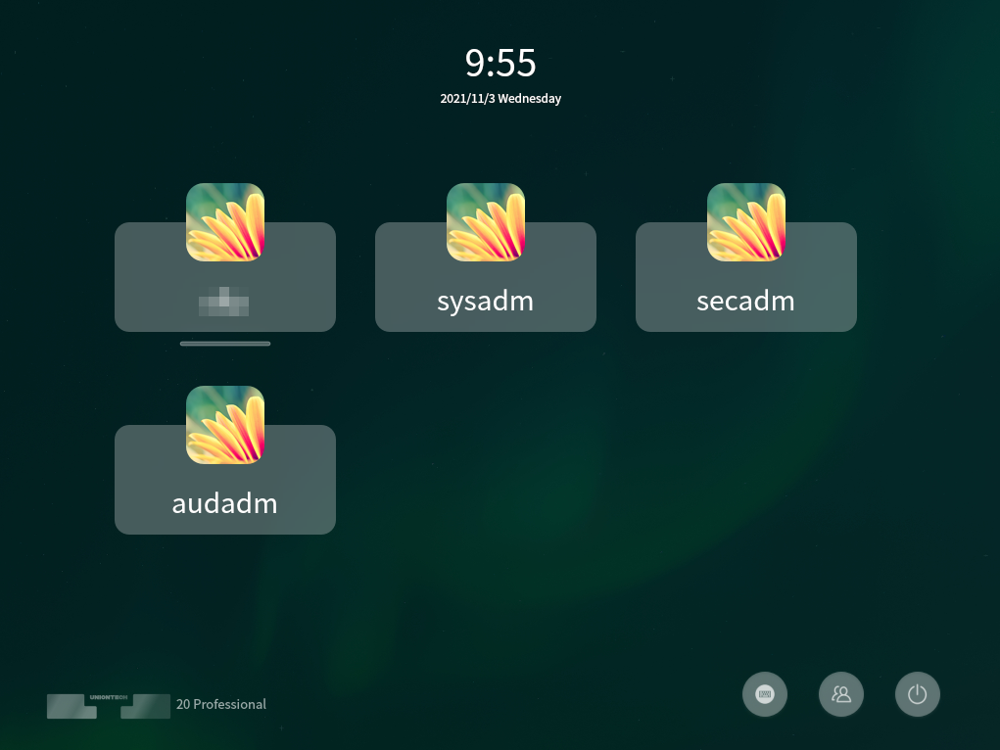

(2) Switch from high to medium or low

The system security level can be switched from high to medium or low only under the security admin account. Neither the system admin nor the audit admin can switch the system security level.

1. If you are not currently a security administrator account, click the switch user icon  on the system login screen, select the secadm and log in.

2. Enter the system security level screen and check "Medium" or "Low". The authentication box pops up, enter the system login password for authentication.

3. After the second confirmation and successful configuration, the three-privilege account is deleted and the normal user privileges are restored, and the level switch takes effect immediately. Configuration related to system security is restored after system reboot.

(3) Switch from low to medium or from medium to low

1. When switching from low to medium or from medium to low, the authentication box pops up, enter the system login password for authentication.
2. Click **Confirm** in the pop-up window. The level switch takes effect immediately after successful configuration. 

**Trusted Protection**

This function mainly checks the integrity of key components of the system, and it is turned off by default.

When the system security level is switched to high, the integrity check switch is turned on at the same time; when the system security level is switched to medium or low, the integrity check switch is turned off at the same time, and it can be turned off or on by itself.

1. In the Trusted Protection interface, some of the protected system files are provided by default and cannot be modified or removed, and the protection policy is disabled by default. For the new component files, you can modify, remove protection, set protection policy and carry out other operations.

2. Click **Add**. The File Manager window pops up and you can manually add the component files to be protected.

   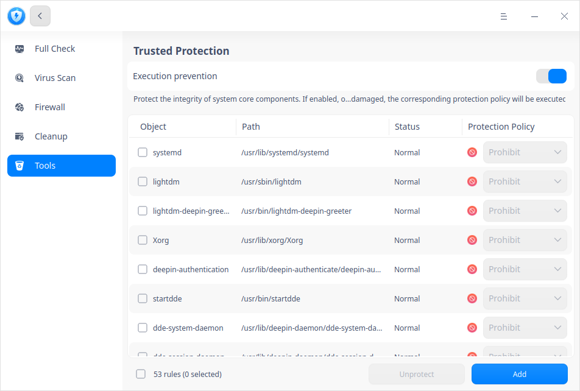

3. The new component file protection policy defaults to "Warning" and can also be set to "Prohibit". 

   - Warning: When integrity is broken and execution is detected, a system notification is issued "if the integrity is damaged, show warnings when executed", you can choose **Ignore** or **Prohibit**.
   - Prohibit: When integrity is broken and execution is detected, the system notification "if the integrity is damaged, prohibit the execution" is issued.

4. If the component file has been modified, the status bar changes from "Normal" to "Tampered".

5. Check the corresponding component file(s) and click **Unprotect** to remove it (them) from protection. 

#### Network Tools

**Internet Control**

Internet Control is turned off by default. Turn on it to set the networking status of a single application in the Launcher. Each application or service has three options in the drop-down box.

- Ask: when an application or service starts up port listening, a prompt saying “xxx wants to connect to the Internet” pops up. And you can select **Allow Once**, **Allow always** or **Disable**. 

- Allow: whenever the application starts up remote connection, it is allowed by default, and no prompt will pop up. 

- Disable: when an application or service starts up port listening, a prompt saying “The firewall has blocked xxx from connecting to the Internet” pops up. And you can select **Go to Settings** or **OK**. 

> Notes: If no network connection is initiated there will be no pop-up message, for example, even if **Ask** or **Disable** is selected for the applications that are not networked, there will be no pop-up message at startup.

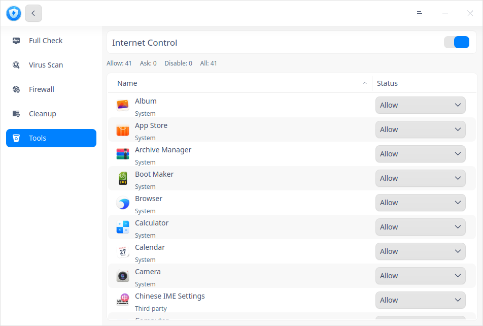

**Data Usage**

The data usage function is turned off by default. When it is turned on, you can monitor the traffic used by applications in the system to access the Internet.

- Apps and Services: view all applications started, and display the current downloading speed and uploading speed of each application. Click the drop-down box to select **Ask**, **Allow** or **Disable**. Refer to [Internet Control](#Network Tools) under Chapter "Tools" to see if the application can connect to the Internet.

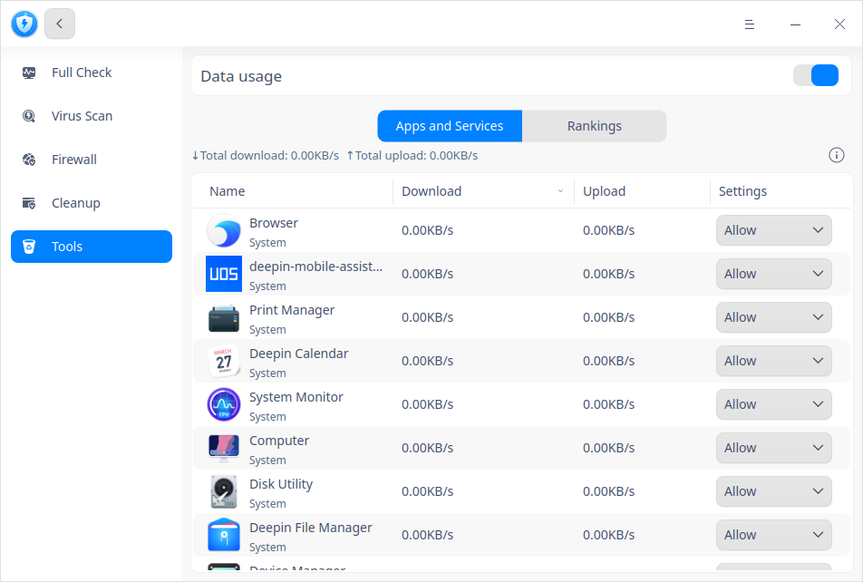

- Rankings: view the traffic ranking of all applications in the Launcher, including downloading traffic, uploading traffic, total traffic and data used details. Click the drop-down box in the upper right corner of the list to switch time span: today, yesterday, this month and last month.

## Main Menu

You can switch themes, view manual and version information in Main Menu.

### Settings

Click  on the interface. Select **Settings**.

#### Basic

**Virus Scan**

- Add "Virus scan" to the context menu: after you check this option, when you right-click a folder, you can select **Virus scan**.
- Do not scan archives larger than xxxMB(20-5120): after you check this option, if a package is larger than the size you set here, it won't be scanned.
- Virus database server address: after you check this option, you can set the address for virus database updating.

**Antivirus Engine**

You can choose "Rising" or "DAS-security".

**Close Main Window**

   - you can click **Minimize to system tray**. When you close the main window, it will be minimized to system tray.
   - you can click **Exit**. When you close the main window, you will exit Security Center directly.
   - you can click **Ask me always**. When you close the main window, the system will pop up a query to get your confirmation.

#### Restore Defaults

Click **Restore Defaults** button to restore the current page to defaults.

### Report issues

1. Click on the interface. 
2. Select **Report issues** to go to **Consults** interface of **Support** application where you can give your feedback.

### Logs

1. Click on the interface. 
2. Select **Logs**, you can view operation logs of Security Center according to "Date and Time" and "Category". You can also select to **Clear below logs**. 

### Theme

The window theme includes Light Theme, Dark Theme and System Theme.

1. Click on the interface.
2. Click  **Theme** to select one.

### Help

View the manual to help you further know and use Security Center.

1. Click on the interface.
2. Click **Help** to view the manual.

### About

1. Click on the interface.
2. Click **About** to view version information and introduction about Security Center.

### Exit

1. Click on the interface.
2. Click **Exit**.

