# 安全中心|deepin-defender|

## 概述

安全中心是一款提供系統安全檢測、病毒查殺、防火牆、垃圾清理以及安全工具等功能的應用軟件。

## 使用入門

您可以通過以下方式運行或關閉安全中心，或者創建快捷方式。

### 運行安全中心

1. 單擊任務欄上的啟動器圖標 ，進入啟動器界面。
2. 上下滾動鼠標滾輪瀏覽或通過搜索，找到安全中心圖標 ，單擊運行。
3. 右鍵單擊 ，您可以：
   - 單擊 **傳送到桌面**，在桌面創建快捷方式。

   - 單擊 **傳送到任務欄**，將應用程序固定到任務欄。

   - 單擊 **加至開機啟動**，將應用程序添加到開機啟動項，在電腦開機時自動運行該應用程序。

### 關閉安全中心

- 右鍵單擊托盤上的安全中心圖標  ，選擇 **退出** 來退出安全中心。

- 在安全中心界面單擊 ，選擇 **退出** 來退出安全中心。

## 操作介绍

### 系統體檢

1. 打開安全中心，選擇左側導航欄的 **系統體檢**，單擊 **立即體檢** 后進行系統體檢。

2. 體檢完後，若有異常則可以對每個問題項單獨操作，還可以單擊 **一鍵修復** 快速修復多項問題。

   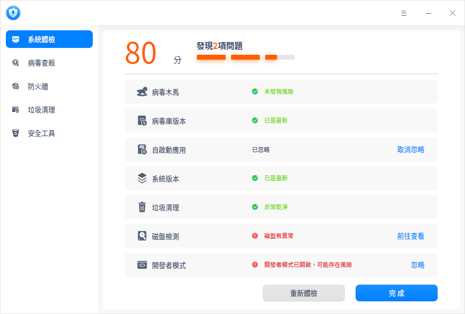
   
3. 處理完成後，單擊 **完成** 返回到系統體檢首頁。

### 病毒查殺
#### 病毒掃描

安全中心支持三種病毒掃描方式，分別為全盤掃描、快速掃描和自定義掃描。

1. 打開安全中心，選擇左側導航欄的 **病毒查殺**。在病毒查殺界面，選擇病毒掃描方式，掃描完成後會顯示掃描結果。

   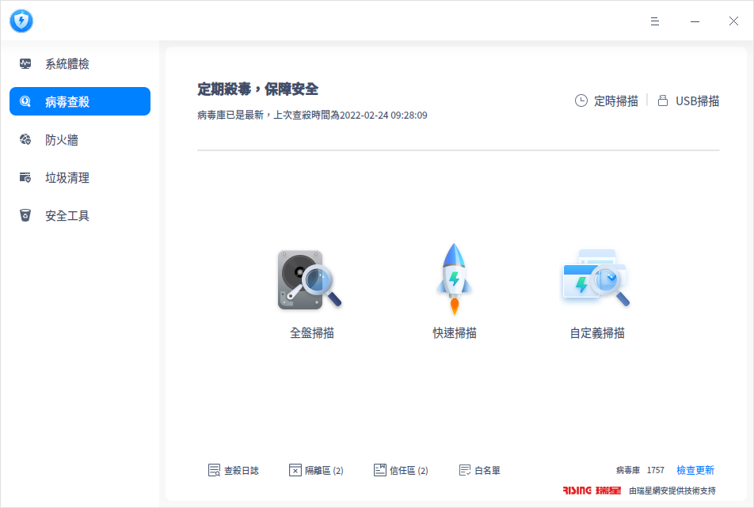

2. 根據掃描結果，可以對每個風險項單獨操作，也可以選擇批量操作。

   **單項操作**：

   - 修復：單擊修復按鈕  後，風險項被修復，下次掃描不會被判定為異常。

   - 隔離：單擊隔離按鈕  後，風險項被隔離，隔離後不會影響其他文件，下次掃描不會被判定為異常，可在隔離區查看。
   
   - 信任：單擊信任按鈕  後，風險項被信任，下次掃描不會被判定為異常，可在信任區查看。

   **批量操作**：
	
	勾選需要處理的風險項後，在頁面底部的下拉框中選擇 **立即修復**、**立即隔離** 或 **添加信任** 選項後，單擊 **執行**，則可以批量處理風險項。
	
	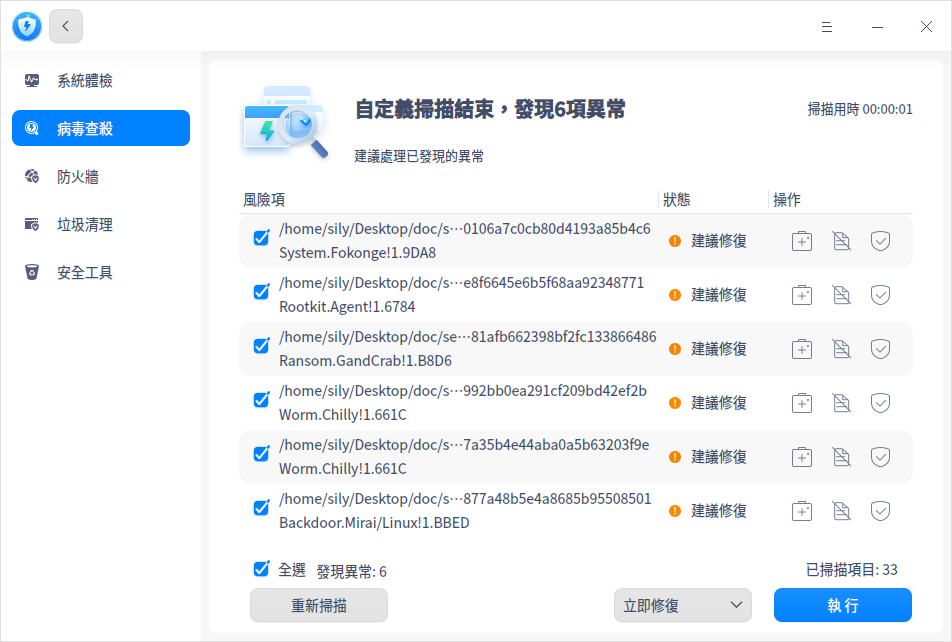

#### 定時掃描

針對快速掃描和全盤掃描，還可以設置定時掃描。定時掃描功能默認關閉，開啟後，可以根據設置的內容執行病毒掃描任務。

- 掃描類型：支持選擇快速掃描或全盤掃描。
- 掃描時間：選擇或自定義掃描時間。
- 發現病毒處理方式：
  - 詢問：發現病毒後彈出處理提示，可以選擇 **忽略** 不處理，還可以選擇 **立即處理**。若不做任何處理，則默認取消不處理。
  - 自動處理：掃描完成後自動處理異常病毒。

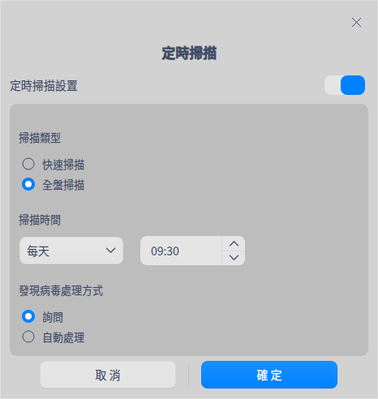

#### USB掃描

對於USB存儲設備，可以設置是否自動掃描及發現病毒處理方式。

- 詢問：發現病毒後，可以選擇 **立即處理** 將病毒隔離或選擇 **取消** 退出掃描。
- 自動處理：掃描完成後自動處理異常病毒。

#### 隔離區

在病毒查殺界面，單擊 **隔離區**，可查看隔離文件列表，還可以選擇將文件移出隔離。

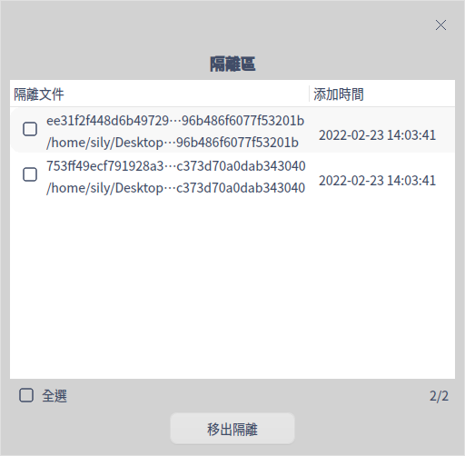

#### 信任區

在病毒查殺界面，單擊 **信任區**，可查看信任文件列表，還可以選擇將文件移出信任。

#### 白名單

在病毒查殺界面，單擊 **白名單**，將文件加入白名單後，病毒掃描時則會被跳過。若文件發生變化，將導致信任失效，並自動從白名單目錄中移除。

#### 查殺日誌

在病毒查殺界面，單擊 **查殺日誌**，可查看每次病毒掃描的時間、掃描類型及結果。單擊詳情按鈕 ，可查看日誌詳情，還可以選擇刪除日誌。

#### 病毒庫更新

每天都有新病毒產生，所以要定期更新病毒庫，以滿足計算機的安全需求，當前支持病毒庫在線更新和離線更新。

**在線更新**

當檢測到新的病毒庫時，在病毒查殺界面，單擊 **更新** 進行病毒庫更新。如果沒有檢測到新的病毒庫，可以單擊 **檢查更新** 進行檢查。

**離線更新**

如果因為斷網等情況無法在線更新病毒庫，則可以選擇離線更新。

1. 在安全中心界面，單擊 。
2. 選擇 **病毒庫離線更新**，彈出文件管理器，導入對應的.zip格式病毒庫文件。如果當前使用的殺毒引擎是瑞星網安，則必須導入瑞星網安病毒庫文件。
3. 導入成功後，病毒查殺界面右下角的病毒庫版本更新為導入後的版本號。

### 防火牆

打開安全中心，選擇左側導航欄的 **防火牆**。在防火牆界面，開啟或關閉防火牆需要輸入系統登錄密碼進行認證。

防火牆開關默認關閉，網絡防護策略無法生效。開啟後默認選中專用網絡策略，也可以切換為公共網絡策略或自定義網絡防護規則。

>   說明：當系統安全等級切換為高或中時，防火牆開關則會開啟。

- 公共網絡防護：主要為車站、商場、咖啡廳等公共網絡信號，執行公網場景下的默認策略。

- 專用網絡防護：主要為辦公、家庭網絡場景，執行專網場景下的默認策略。

- 自定義網絡防護規則：選擇此項後，您可以自行配置高級防火牆規則。

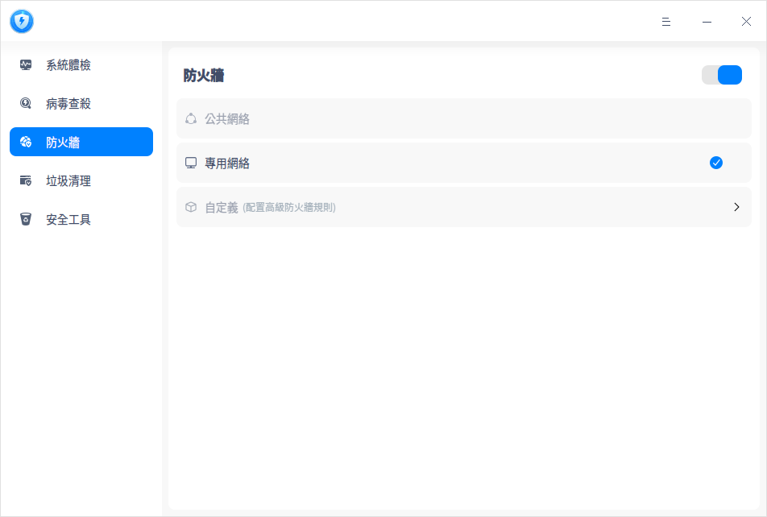

#### 自定義規則

1. 在防火牆界面，勾選「自定義」，單擊更多圖標 >，進入配置界面。

2. 單擊 **添加** 按鈕，填寫或勾選防火牆規則訊息，包括規則名稱、程序服務、策略、方向。協議等。

   - 規則名稱：規則名稱不可重複，可以使用默認名稱或自定義名稱。

   - 程序服務：默認選擇全部服務，也可以在下拉框中勾選或在輸入框模糊搜索對應的服務。

   - 策略：默認選擇允許，表示允許數據包傳輸。選擇拒絕，表示不允許數據包傳輸。

   - 方向：默認選擇出入站，出站表示本地主機訪問外部數據，入站表示外部數據進入本地主機。

   - 協議：系統支持的通信協議，默認選擇TCP，也可以在下拉框中勾選或在輸入框模糊搜索對應的協議。

   - 本地端口/IP：非必填項，表示本地主機的端口號和IP，填寫規則可以參考示例。

   - 遠程端口/IP：非必填項，表示遠程主機的端口號和IP，填寫規則可以參考示例。

   - 狀態：默認不勾選，表示該規則已停用。勾選後，啟用該規則。
   
   
   
3. 完成所有的訊息後，單擊 **保存** 按鈕。添加成功後，在配置頁面查看規則列表。

   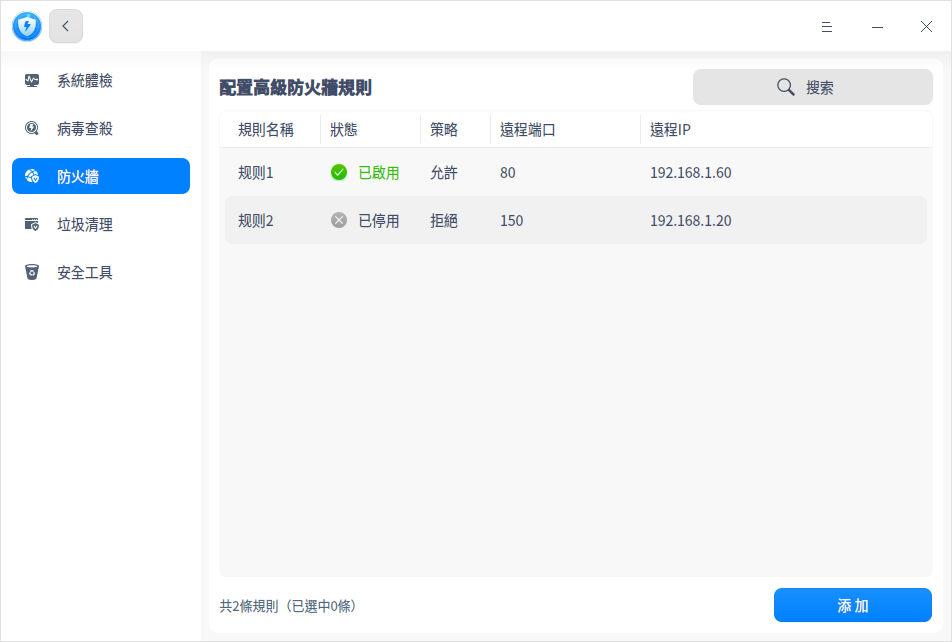

4. 如果添加了多個規則，默認已啟用的規則優先顯示在前面並按照創建時間降序排列，已停用的規則在後面顯示且按照創建規則時間的降序排列。當先後創建的規則有衝突時，以最後創建的啟用規則為準。

#### 右鍵菜單

對於已添加的規則，根據啟用狀態可以進行相關操作。

單項操作：

- 已啟用的規則：在右鍵菜單中，只能執行停用操作。
- 已停用的規則：在右鍵菜單中，可以執行修改、啟用或刪除操作。

多項操作：

- 全為已啟用的規則：在右鍵菜單中，只能執行停用操作。
- 全為已停用的規則：在右鍵菜單中，可以執行啟用或刪除操作。
- 包含已啟用和已停用的規則：在右鍵菜單中，可以執行啟用、停用或刪除操作。

### 垃圾清理

操作系統在日常運行中會產生各種垃圾，當垃圾越來越多，會影響系統的運行效率，浪費磁盤資源。建議定期清理垃圾，保障系統運行流暢，提升資源利用率。

1. 打開安全中心，選擇左側導航欄的 **垃圾清理**，進入垃圾清理界面。

2. 勾選對應的垃圾類型，當前可以選擇清理系統垃圾、應用垃圾、痕跡訊息和Cookies。

   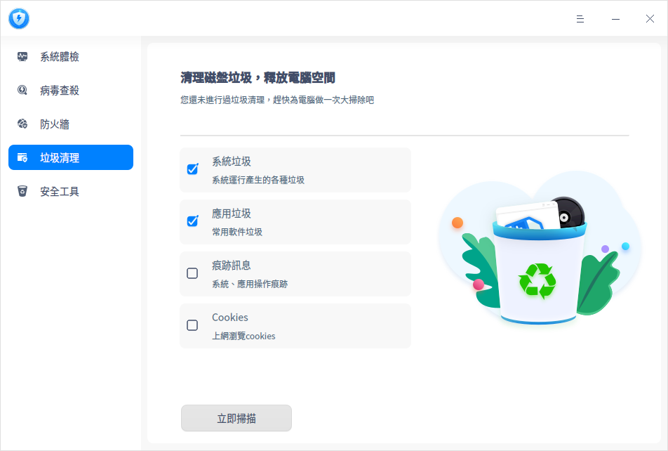

3. 單擊 **立即掃描**，進入掃描界面。

4. 掃描完成後，可查看掃描發現的垃圾，並進行相應的處理。
   - 立即清理：清理所有選中的垃圾，您還可以自行取消勾選或者增加勾選。

   - 返回：不做任何處理，返回到垃圾清理界面。

5. 清理完成後單擊 **完成** 即可，清理過程中還可以單擊 **取消清理**。

### 安全工具

打開安全中心，選擇左側導航欄的 **安全工具**。安全工具包括系統工具和網絡工具，單擊對應圖標則可以使用小工具。

#### 系統工具

**USB安全**

在USB安全界面，可以查看帶存儲功能的 USB 設備連接電腦的紀錄。

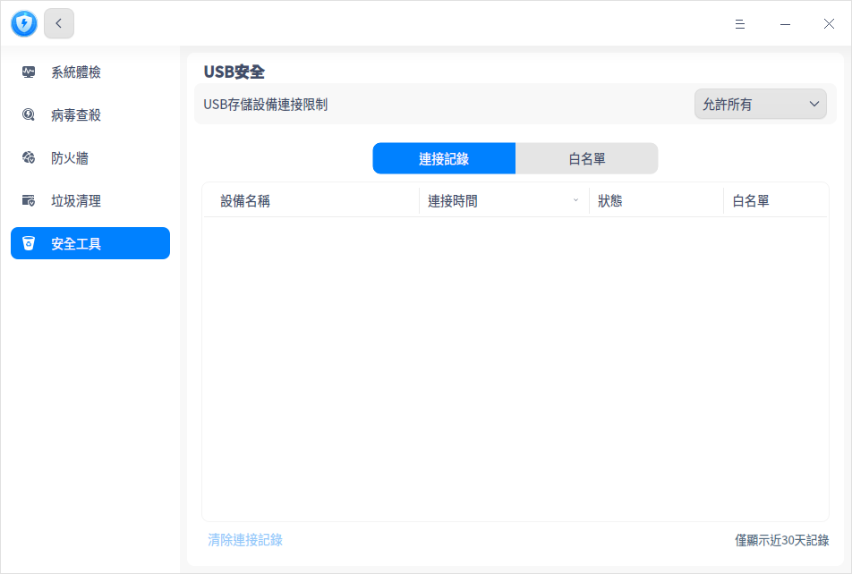

還可以將常用的USB設備加入白名單，設置只允許白名單設備連接電腦，防止電腦數據洩露。

**登錄安全**

在登錄安全界面，可以設置密碼安全等級，還可以設置密碼到期提醒時間，定期更換密碼。

- 安全等級為 **高** 或 **中** ：在控制中心修改密碼，或創建新用戶設置密碼時，若設置的密碼不符合級別要求，會保存失敗，您可以前往安全中心修改等級或重新設置密碼。

- 安全等級為 **低** ：在控制中心修改密碼，或創建新用戶設置密碼的時候，直接保存新設置的密碼。

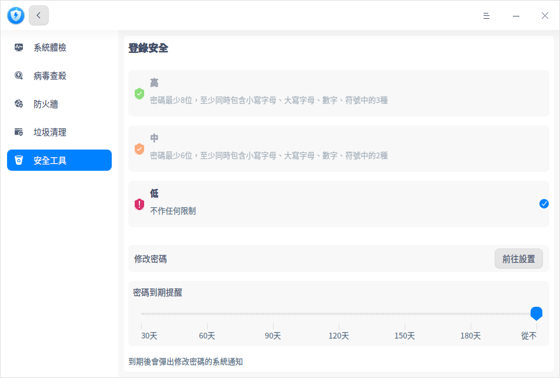

**自啟動應用**

開機自啟動管理界面僅顯示啟動器裏的應用，包括應用名稱、自啟動狀態和操作按鈕。每個應用可選擇允許或禁止開機自啟動。

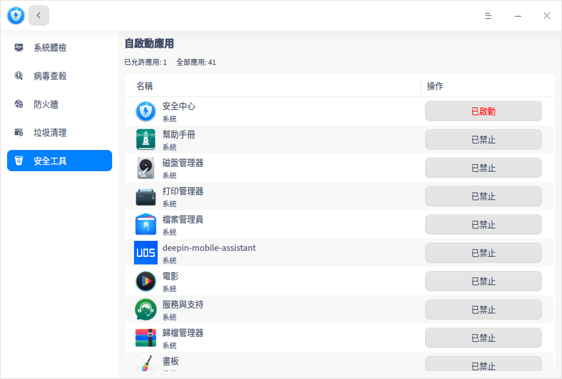

**系統安全等級**

系統安全等級配置功能入口默認隱藏，啟用後會加強對系統權限的控制。如果需要使用，可以聯系統信技術支持獲取開啟方式。

根據使用場景，選擇適合系統安全等級配置，默認系統安全等級為低。

- **系統安全等級-高**：開啟等保三級的安全防護，開啟身份鑑別、自主訪問控制、標記和強制訪問控制、安全審計、數據完整性校驗、數據保密性、網絡安全、運行安全、資源監控等安全保護。同時開啟三權分立，配置系統管理員、系統審計管理員、系統安全管理員帳號密碼。
- **系統安全等級-中**：開啟系統基礎安全保護，同時開啟防火牆網絡安全保護、密碼安全等級調整為中，保護系統安全。
- **系統安全等級-低**：適用於可信任的使用環境，提供基礎安全防護。

（1）系統安全等級由低或中切換為高

1. 在系統安全等級界面，勾選「高」。彈出授權框，輸入系統登錄密碼進行認證。

   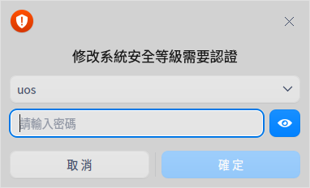

2. 彈出二次確認窗口，單擊 **確定**。配置系統管理員、審計管理員、安全管理員帳號密碼，每個管理員分配不同的權限。

   - 系統管理員（sysadm）：創建、刪除用戶，安裝軟件，系統相關設置；

   - 審計管理員（audadm）：添加審計規則，查看審計日誌；

   - 安全管理員（secadm）：管理用戶安全上下文，查詢、設置安全配置；

   

3. 配置成功後，重啟系統生效，普通用戶部分權限會受限。在系統登錄界面會顯示三個管理員帳戶，可以進行切換。

   

（2）系統安全等級由高切換為中或低

只有在安全管理員帳戶下，系統安全等級可以從高切換為中或低。系統管理員和審計管理員帳戶都無法切換系統安全等級。

1. 如果當前不是安全管理員帳戶，在系統登錄界面單擊切換用戶圖標 ，選擇secadm用戶並登錄。

2. 進入系統安全等級界面，勾選「中」或「低」。彈出授權框，輸入系統登錄密碼進行認證。

3. 二次確認，配置成功後，刪除三權帳戶、恢復普通用戶權限，等級切換立即生效。系統重啟後恢復系統安全相關配置。

（3）系統安全等級由低切換為中或由中切換為低

1. 在系統安全等級界面，由低切換為中或由中切換為低時，需要系統登錄密碼進行認證。
2. 二次確認，配置成功後，等級切換立即生效。

**可信保護**

主要對系統關鍵組件進行完整性校驗，可信保護功能默認關閉。

當系統安全等級切換為高時，同步開啟完整性檢查開關；當系統安全等級切換為中或低時，同步關閉完整性檢查開關，可以自行關閉或開啟。

1. 在可信保護界面，默認提供部分受保護的系統文件，不可修改，不可移除，保護策略默認禁止。對於新增的組件文件，則可以進行修改、移除保護，設置保護策略等操作。

2. 單擊 **添加** 按鈕，彈出文件管理器窗口，可以手動添加需保護的組件文件。

   

3. 新增的組件文件保護策略默認為「警告」，也可以設置為「禁止」。

   - 警告：當完整性被破壞且被檢測到執行時，發出系統通知「xxx組件完整性被破壞，是否允許執行」，您可以選擇 **忽略** 或 **禁止**。
   - 禁止：當完整性被破壞且被檢測到執行時，發出系統通知「xxx組件完整性被破壞，禁止執行」。

4. 如果組件文件被修改了，狀態欄從「正常」變為「已篡改」。

5. 勾選對應的組件文件，單擊 **移除保護**，移除後則不再受保護。 

#### 網絡工具

**聯網控制**

在聯網控制界面，聯網控制功能默認關閉。開啟後，可以設置列表中單個應用聯網的狀態，每個應用或服務下拉框有三種選項。

- 詢問：應用聯網時給出提示「xxx需要連接網路」，您可以選擇 **僅允許本次**、**始終允許** 或 **禁止**。 

- 允許：應用聯網時默認允許，不會有提示訊息。

- 禁止：應用聯網時給出提示 「 防火牆已禁止xxx連接網路」，您可以選擇 **前往設置** 或 **確定**。 

>  說明：如果不發起網絡連接則不會有提示訊息，比如本身就不會聯網的應用，即使選擇 **詢問** 或 **禁止** 也不會在啟動時彈出提示。

  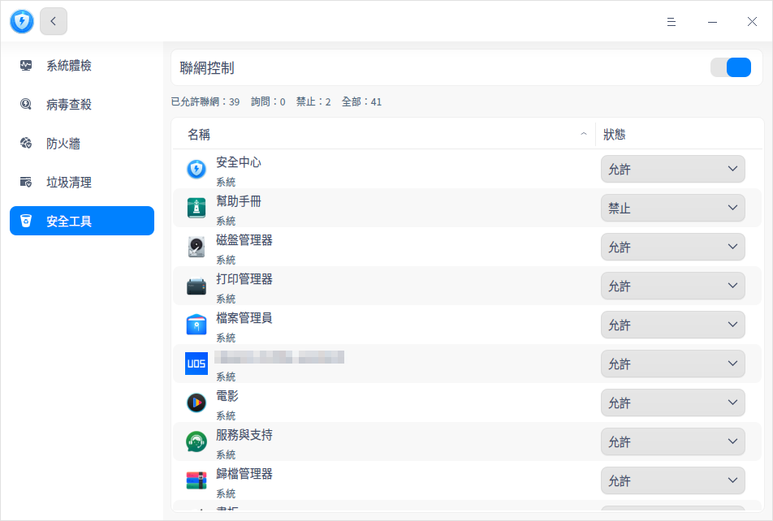

**流量監控**

在流量監控界面，流量監控功能默認關閉。開啟後，可以對系統裏應用上網所使用的流量情況進行監控。

- 當前聯網：查看所有啟動中的應用，並展示每個應用當前的下行網速、上行網速。單擊管控下拉框，可以選擇 **詢問**、**允許** 或 **禁止** 選項，控制應用是否能聯網，詳細操作請參考安全工具中 [聯網控制](#網絡工具)。

  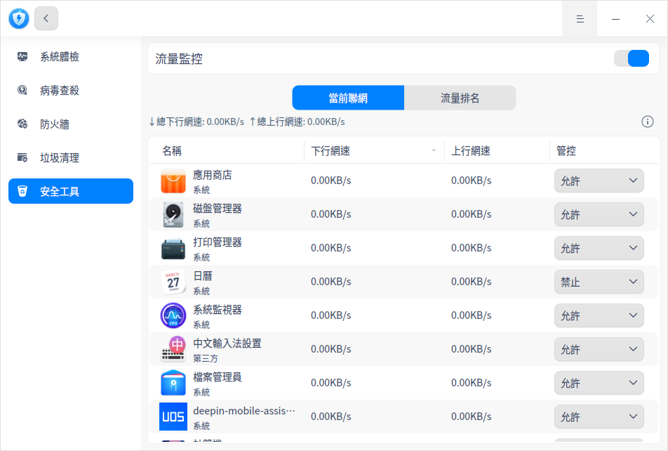

- 流量排名：查看啟動器裏所有應用的流量排名，包括下行流量、上行流量、總流量、流量時間分佈詳情。列表右上角支持切換時間跨度：當天、昨天、當月、上月。

  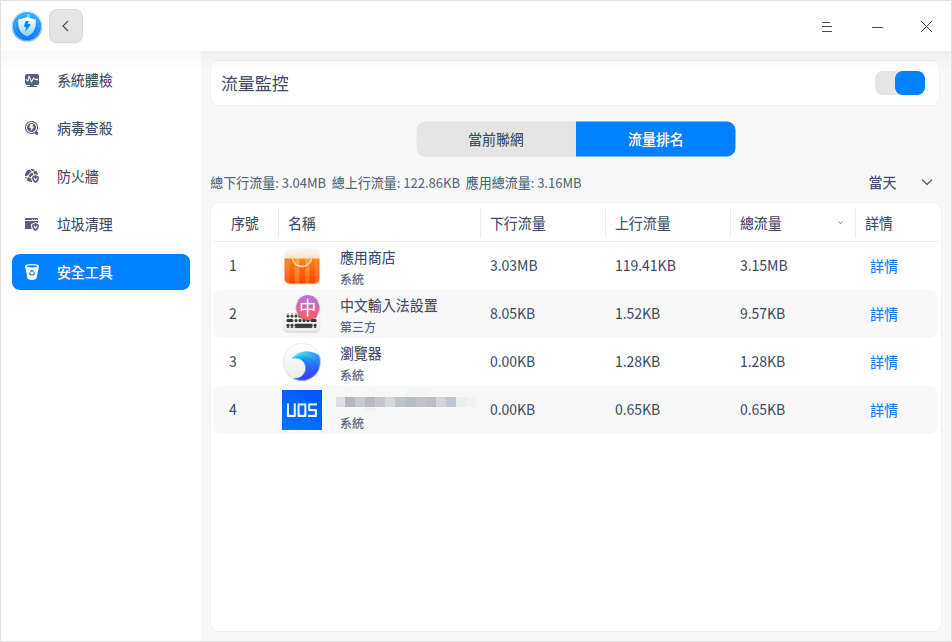

## 主菜單

在主菜單中，您可以進行相關參數設置、問題反饋、切換窗口主題，查看幫助手冊等操作。

### 設置

在安全中心界面，單擊 ，選擇 **設置** 後進行基礎設置。

#### 基礎設置

**病毒查殺**

- 加入 “病毒查殺” 到文件右鍵菜單：勾選後，單擊文件（夾）右鍵可直接選擇 **病毒查殺**。
- 不掃描超過此大小的壓縮包：勾選後，若壓縮包超過設定的大小，則不會進行掃描。
- 病毒庫升級地址：勾選後，可設置病毒庫升級地址。

**殺毒引擎**

可以選擇瑞星網安或安恆訊息殺毒引擎。

**關閉主窗口**

- 選擇 **最小化到系統托盤**，關閉主窗口時，應用將隱藏到系統托盤。
- 選擇 **退出**，關閉主窗口時直接退出應用。
- 選擇 **每次詢問**，每次關閉主窗口時會彈出確認彈框。

#### 恢復默認

單擊 **恢復默認** ，恢復默認設置。

### 用戶反饋

1. 在安全中心界面，單擊 。
2. 選擇 **用戶反饋**，跳轉到「服務與支持」應用的留言諮詢界面，您可以反饋相關問題。

### 安全日誌

1. 在安全中心界面，單擊 。

2. 選擇 **安全日誌**，可以根據日誌類型和日期查看安全中心的操作日誌，還可以選擇清除日誌。

   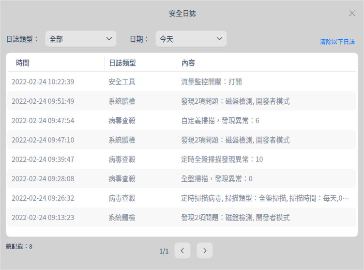

### 主題

窗口主題包含淺色主題、深色主題和跟隨系統主題。

1. 在安全中心界面，單擊 。
2. 選擇 **主題**，選擇一個主題顏色。

### 幫助

1. 在安全中心界面，單擊 。
2. 選擇 **幫助**，查看幫助手冊，進一步了解和使用安全中心。

### 關於

1. 在安全中心界面，單擊 。
2. 選擇 **關於**，查看安全中心的版本和介紹。

### 退出

1. 在安全中心界面，單擊 。
2. 選擇 **退出**。

 